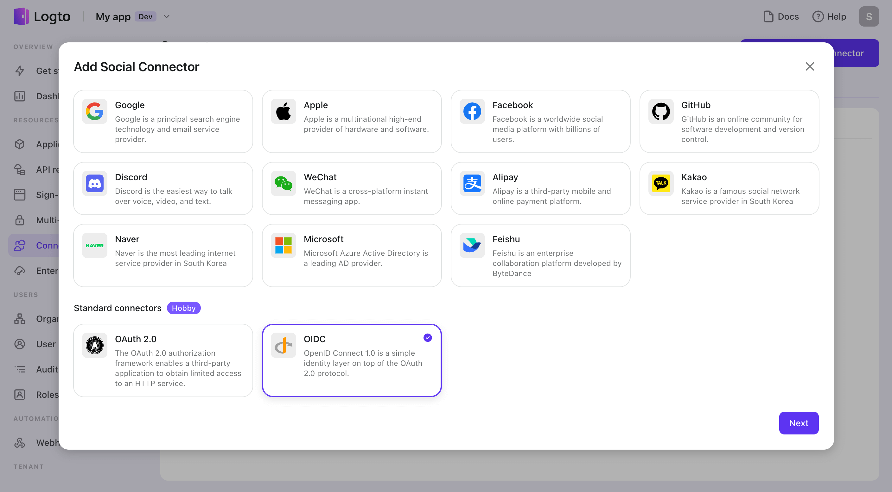
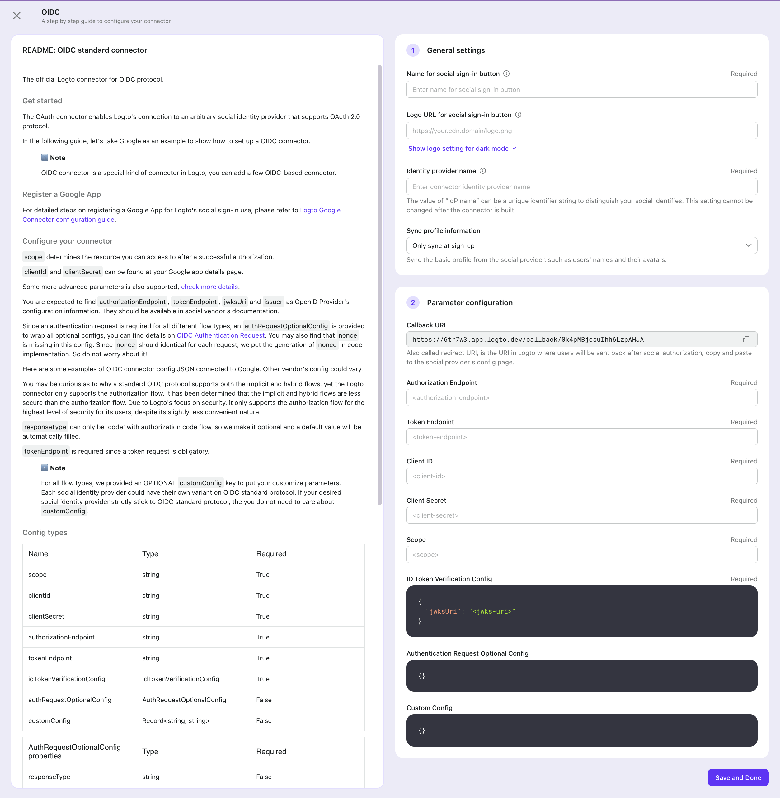

# Custom Social Connector with Standard  Protocol

Logto supports standard connectors such as OAuth2.0, OIDC, and SAML, which are widely used for authentication and authorization in many applications and services. With these standard protocols, you can easily configure your specific social connectors to connect external identity providers.

Follow the README to compose the connector config with little effort.

- [OAuth 2.0](https://github.com/logto-io/connectors/tree/master/packages/connector-oauth2)
- [OIDC](https://github.com/logto-io/connectors/tree/master/packages/connector-oidc)
- [SAML](https://github.com/logto-io/connectors/tree/master/packages/connector-saml)

:::tip
We highly recommend using Logto's preinstalled social connectors, including Google, Apple, Facebook, GitHub, Discord, Wechat, Alipay, Kakao, Naver, and Microsoft Azure AD, as they are simple to configure and highly stable.
Our standard connectors can meet most custom requirements, but if you need a specific connector beyond these, feel free to contact us. For those using the Logto Open-Source Version, you can even [Write your connector](../../create-your-connector/README.md).
:::

## Configure steps

To add a new standard connector in Logto Console, navigate to “**Connector > Social connectors**” and click the “**Add Social Connector**” button. Then Select the desired social connector type in the Modal that appears and click the “**Next**” button. 

**Each standard connector can create multiple social connectors!**

When customizing a standard connector, you will need to configure more general settings, such as the social sign-in button name and logo, and the IdP name.

1. **Name for social sign-in button**: The name of the connector button will be displayed as "Continue with {{name}}." Be mindful of the naming length in case it gets too long.
2. **Logo for social sign-in button**:  Logto also supports adding different logo images for light and dark modes, with the dark mode logo taking effect after enabling Dark Mode in the Sign-in Experience tab of the Console.
3. **Identity provider (IdP) name**: IdP name is a unique identifier for each social connector and cannot be changed after it's built.
    1. When configuring a new Standard connector with a new Identity Provider, you just need to enter a unique "IdP name" that hasn't been used before. This will allow you to distinguish the new social connector from others that have been created.
    2. If you need to replace an existing social connector with the same identity provider, you must delete the old one and create a new one with the same “IdP name”. 
    3. You can learn more about usage cases of IdP name by visiting the “[Recipe: IdP name](../../../references/connectors/README.mdx)”.
4. Standard Connector also can choose how to “**sync user profiles**” (such as avatars and usernames). The default setting is to only sync at registration. Still, you can also choose to always sync at each sign-in, but be careful that this may overwrite customized information in your application at user each social sign-in.
5. Finally, note that different standard connectors require different configuration parameters. You can refer to the left **README** for guidance on filling out the forms.

## Related Readings

- See [Configure sign-in method](../../customize-sie/configure-sign-in-methods.mdx) by adding connectors to bring your social connector into use.
